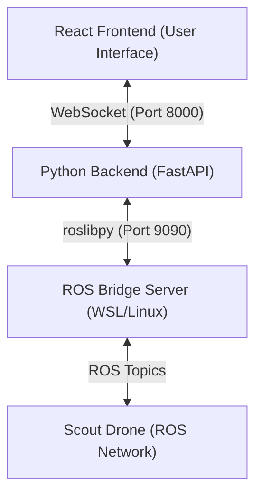

# Unified Control Dashboard

**The Central Command Unit for the Autonomous Drone System.**

This repository serves as the primary interface for mission planning, real-time telemetry monitoring, and system authorization. It bridges the gap between a high-level user interface and the low-level ROS network running on the drones.

## System Architecture

The complete system is composed of three logical units, referred to as "The Trinity":

| Component | Hardware | Function | Communication Protocol |
| :--- | :--- | :--- | :--- |
| **1. Unified Control** | Windows Laptop | Command & Control (C2), Mission Planning, KML Uploads. | WebSocket / ROS Bridge |
| **2. Perception Node** | Scout Drone (Jetson) | Artificial Intelligence, Object Detection (YOLO), Video Processing. | ROS Native |
| **3. Scout Node** | Scout Drone (Mavlink) | Flight Control, Path Planning (Lawnmower), Collision Avoidance. | MAVLink / ROS |

### The Bridge Architecture

Scale and compatibility are achieved by decoupling the Operator's interface from the Robot Operating System (ROS).

1.  **Linux/WSL Side**: Hosts `roscore` and `rosbridge_server`. This acts as the gateway, exposing the internal ROS network as a WebSocket on port `9090`.
2.  **Windows Side (Backend)**: A Python application using `roslibpy`. It connects to the ROS Bridge (`ws://localhost:9090`) and translates high-level commands into ROS topics.
3.  **Frontend**: A React application connecting to the Backend via WebSockets (`ws://localhost:8000/ws`) to provide a real-time, low-latency dashboard.



## Getting Started

### Prerequisites

*   **Node.js** (v16+, for Frontend)
*   **Python 3.10+** (for Backend)
*   **ROS Noetic** (Running on a separate Linux machine or WSL instance)

### 1. Configure the ROS Environment (Linux/WSL)

The ROS Bridge must be running to enable communication between the Windows Laptop and the Drones.

**Critical Step:** You must source your workspace before launching the bridge to ensure custom messages are loaded.

```bash
# In your Linux/WSL Terminal
source ~/catkin_ws/devel/setup.bash
roslaunch rosbridge_server rosbridge_websocket.launch
```

### 2. Start the Backend (Windows)

The backend handles the business logic and ROS translation.

```powershell
cd backend
# Create virtual environment (First time only)
python -m venv venv

# Activate and Install
./setup.sh 

# Run the Server
py -m app.main
```

The server will start at `http://localhost:8000`.

### 3. Launch the Dashboard (Windows)

The frontend provides the visual interface.

```powershell
cd frontend
npm install
npm run dev
```

The dashboard will be accessible at `http://localhost:5173`.

## Features

*   **Mission Control**: Start and Abort autonomous search missions.
*   **KML Integration**: Upload Google Earth KML files to dynamically define search boundaries.
*   **Real-Time Telemetry**: Monitor target detection counts and drone status instantly.
*   **Secure Logging**: Local system logs for connection and mission tracking.

## Troubleshooting

### Connection Failed / Red Status

If the Dashboard shows "DISCONNECTED" or the Backend logs an error:

1.  **Check ROS Bridge**: Ensure `rosbridge_websocket.launch` is running in WSL.
2.  **Import Errors**: If you see `Unable to import custom_msgs`, you forgot to source your workspace. Stop the bridge, run `source ~/catkin_ws/devel/setup.bash`, and restart.
3.  **Network**: Ensure no firewall is blocking ports `8000`, `5173`, or `9090`.
